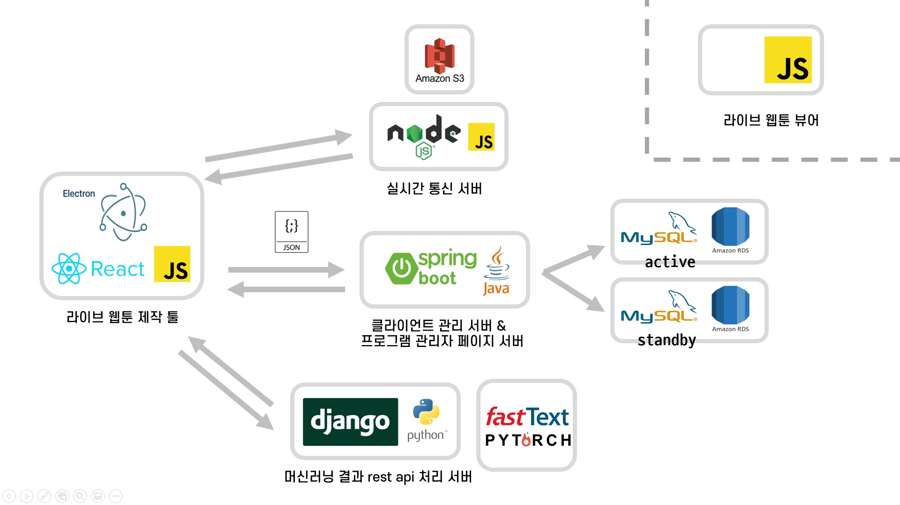

# Sotact-Client

## Introduction

>기존에 작업된 이미지 리소스를 활용하여 애니메이션 작업을 처리하는 클라이언트 입니다.  
>일렉트론으로 개발하여 다양한 플랫폼에서 빌드 및 실행이 가능합니다.  
>애니메이션은 HTML5 Canvas를 통해 처리하며 이를 위해 KonvaJS 라이브러리를 활용합니다.  
>스크롤 기반의 애니메이션만 구현되어있으며 시간 기반의 애니메이션은 추가중입니다. 


## Architecture





## Dependency


| 라이브러리 | 버전 | 비고 |
|---|:---:|:---:|
| @emotion/core | 10.0.28 | - |
| @emotion/styled | 10.0.27 | - |
| electron-prompt | 1.6.0 | - |
| Konva | 7.0.3 | - |
| lodash | 4.17.19 | - |
| next | 9.4.4 | - |
| psd | 3.2.0 | - |
| react | 16.13.1 | - |
| react-dom | 16.13.1 | - |
| request | 2.88.2 | - |
| socket.io | 2.3.0 | - |
| tar | 6.0.5 | - |
| cross-env | 7.0.2 | dev |
| electron | 9.2.0 | dev |
| electron-builder | 22.8.1 | dev |


## Installation

### Setup
```bash
#clone repository
git clone https://git.swmgit.org/swmaestro/sotact.git
#install dependencies
yarn install
```


## Usage

### Build / Export  
```bash
#build & export
yarn build && yarn export
```
### Launch  
```bash
#build & Launch
yarn rex
```

## Build Info

### Electron Builder
- Windows
  - nsis 
  - onclick install
  - file association 
    - psd
    - taw


## Features
- PSD, TAW 확장자 파싱  

- 작업환경 확대/축소

- 스크롤 높이에 따른 애니메이션 적용  
  - 컷당 스크롤 높이 0~100%
    - 컷이 보이기 시작할 때 : 0%
    - 컷이 완전히 사라질 때 : 100%
  - 애니메이션  
    - 좌표 변화
    - 오브젝트 회전
    - 투명도 변화  
    - 복합 연산 기능
    - 가로 세로 배율
    <br/>

- 웹에서 바로 적용가능한 형태로 데이터 저장
  - PSD 파일은 그룹/레이어 별로 png로 저장

  - 애니메이션 데이터는 JSON으로 저장
  <br/>
- 전용 확장자 taw 지원
  - tar 베이스로 동작하여 호환성 항샹

- 브라우저의 렌더 주기에 맞춘 처리로 부드러운 움직임


## Todo
- [x] PSD 파일 파싱
- [x] 이미지 애니메이션 엔진
  - [x] 좌표 이동
  - [x] 오브젝트 회전
  - [x] 투명도 변환
  - [x] 합성 연산(Composite Operation)
  - [x] 필터링
  - [x] 트랜스폼
- [x] 애니메이션, 이미지 데이터 저장
- [x] 스크롤 단위 애니메이션 
- [x] 시간 단위 애니메이션
- [x] 애니메이션 프리셋
- [x] 프리셋 추천 알고리즘
- [x] Socket을 통한 동시 작업 환경
- [ ] ~~WebRTC를 통한 파일 전송~~
- [x] 클라우드 데이터 내려 받아 작업
- [x] 서버와 로그인 연동
  - [x] 자체 로그인 연동
  - [x] 구글 로그인 연동
  - [x] 카카오 로그인 연동


## React는 왜 사용했나요?

#### react는 필요없어 보이는데 왜 사용했나요?

원래 순수 react 만으로만 프로젝트를 진행하려 했습니다. 

> 개발 시간이 제한되어 있는 상황에서 기획이 몇번 반려 당해 남은 시간이 줄어들었고, 프론트엔드 멘토가 없어서 도움에 어려움이 있었습니다. 
>
> 무엇보다도 react에 대한 사전 지식이 없는 상태에서 진행했으며, 결정적으로 react 내부에서 konva를 다루는 법과 electron과 통신하는 부분에서 학습에 걸릴 것으로 예상되는 시간이 개발시간을 초과했습니다.
>
> 기간안에 프로젝트를 완료하는 것이 목표였으므로 초기에 react로 작성한 레이아웃만 그대로 사용하고 동작 코드는 전부 순수 자바스크립트로 작성하게 되었습니다.
>
> 동작 소스 부분은 /out/static/js 에서 확인 가능합니다.


## FAQ
Q. 왜 PSD 파일을 우선 지원하나요?
> A. 현재 대부분의 드로잉툴(포토샵, 클립스튜디오, 메디방, 사이툴, 코렐드로우)에서 psd 파일 형태의 저장을 지원합니다.  
> 또한 웹툰작가들에게 실제 인터뷰한 결과 포토샵, 클립스튜디오를 가장 많이 사용하였고, psd파일 확장자 또는 png 이미지로 작업하는 것으로 확인되었습니다.  
> 따라서 PSD와 png만을 지원해도 거의 대부분의 툴을 커버할 수 있다고 판단하여 우선 지원하였습니다.  

Q. 파일이 여러개로 나뉘어 저장되는데 원활한 관리를 위한 방법이 없나요?
> A. 해당 의견을 적극 수렴하여 아카이브 형태의 자체 확장자 .taw 를 지원하였습니다.  
> tar 아카이브 형식을 사용하여 쉽게 호환가능한 형태로 단일 파일로 관리할 수 있습니다.  

Q. 파일의 저장되는 형식은 어떤 방식이며 어떻게 뷰어로 연동하나요?
> A. 파일을 작업하고 난 후에는 이미지 데이터는 png로, 애니메이션 데이터는 json으로 저장됩니다.  
> 저장되는 경로는 "저장이름/임의16진수값-파일명" 형식으로 저장되며 저장이름의 폴더를 클라이언트의 컷 폴더로 적용하시면 됩니다.  
> 파일은 .taw 형식으로 압축되어 저장되며 기존의 여러 파일 형태와 아카이브 형태 모두 사용 가능합니다.

Q. Socket.io를 활용한다고 하였는데, 왜 사용하는 건가요?
> A. 여러 사용자가 동시에 작업을 할 때 메타데이터 동기화를 위해 Socket.io를 사용합니다.  
> 작업 데이터 전송에 있어 여러 클라이언트가 겹치는 작업을 요청하는 것에 대한 예외를 처리하고자 주도권이 서버에 있는 TCP 기반 Socket.io를 활용합니다.  
> 신뢰하는 메타데이터는 Socket.io 서버가 가지고 있으며 모든 클라이언트는 서버를 기준으로 메타데이터를 동기화합니다.  
> 룸형식의 통신 공간을 만들어 메타 데이터를 공유합니다.  

Q. WebRTC가 왜 사용되지 않았나요?
> A. 실제로 데이터를 처리하는데 있어서 WebRTC를 사용해야할 정도의 큰 트래픽 이동이 없을 것으로 판단하였습니다.    
> 따라서 기존에 WebRTC로 진행하고자 했던 코드부분을 전부 Socket.io로 대체하도록 작성하였습니다.

Q. Mac OS 버전은 지원할 생각이 있나요?
> A. 현재 일렉트론 기반으로 개발을 하여 약간의 호환성 부분만 해결하면 Mac에서 돌아가는 빌드 버전도 약간의 작업을 거쳐 만들 수 있습니다.  
> 기능을 우선으로 개발하여 윈도우 플랫폼만 빌드형태를 고려하고 있지만 추후 Mac 버전도 빌드할 생각입니다.

Q. 프리셋이 양이 많지 않은데 늘릴 생각인가요?
> A. 아직 많은 실행 데이터가 있지 않기 때문에 가장 많이 사용될 기초형태의 프리셋만 제공하고 있습니다.  
> 사용자들의 누적 데이터가 쌓이면 해당 데이터를 바탕으로 새로운 프리셋을 계속 추가할 생각입니다.


## Sotact-FrontEnd Contributors

박석환 : master@esllo.com

2020/11/19

2022/06/08 updated
