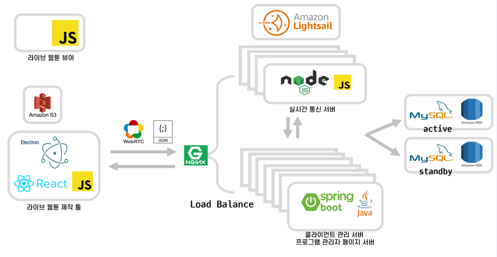

# Sotact-Client

## Introduction

데스크탑 기반 프로그램으로 사용자에게 제공되어 생동감있는 웹툰을 제작할수 있게 해주는 도구입니다.  
제일 빈번히 사용되는 psd파일을 지원해 기존 원고 작업물을 별 다른 설정없이 제작 툴에서 사용 할 수 있습니다.  
또한 여타 도구(After Effect)등에서 layer grouping 관련 시, 사용자의 의도대로 grouping이 되지 않는 경우가 발생합니다. 그러나, 여기서는 그런 grouping없이도 사용가능합니다.  
또한 다양한 애니메이션 효과들과, 작업물 저장시 Cross Browsing을 반영해 어떠한 브라우져에서 보더라도 이질감이 없는 형태로 제작가능하게 해줍니다. 

### Architecture

---

### Version

---

react 16.13.1  
react-dom 16.13.1  
konva 7.0.3  
next 9.4.4  
electron 9.2.0  
cross-env 7.0.2  
psd 3.2.0  

### Sotact-FrontEnd Contributors

---

박석환 : master@esllo.com